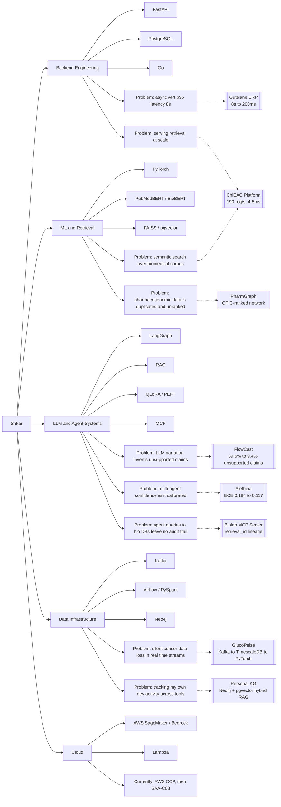

# Hi, I'm Srikar 👋

**Data Scientist Fellow @ ChiEAC** · MS Computer Science, Boston University (Jan 2026) · Biotech background

I build retrieval systems, agentic pipelines, and provenance infrastructure for biomedical and scientific applications, validated against real baselines, not vibes.

---

### 🚀 Featured Projects

<table>
<tr>
<td width="50%" valign="top">

**[🧬 FlowCast](https://github.com/srikarjy/Flowcast)**
Go CLI diagnosing nf-core/rnaseq pipeline runs

Modified Z-score (MAD) classifier → **F1 0.870**, a **23% lift** over fixed-threshold baseline. LLM narration cut unsupported causal claims **39.6% → 9.4%** on a 48-case golden set.

</td>
<td width="50%" valign="top">

**[⚖️ Aletheia](https://github.com/srikarjy/Aletheia)**
Multi-agent scientific reasoning, agents debate before concluding

 

Historical-outcome calibration cut confidence ECE **0.184 → 0.117**. Counterfactual eval caught **13/16** known memory-induced regressions.

</td>
</tr>
<tr>
<td width="50%" valign="top">

**[🩸 GlucoPulse](https://github.com/srikarjy/GlucoPulse)**
Real-time CGM streaming pipeline, ingestion to serving

 

TFT model evaluated against a persistence baseline at 30 and 60 minute forecast horizons. Full stack: Kafka, TimescaleDB, PySpark, Airflow, ONNX, Grafana.

</td>
<td width="50%" valign="top">

**[📱 BioFeed AI](https://github.com/srikarjy/BioFeed-AI)**
iOS biotech intelligence app, SwiftUI + FastAPI

 

Implicit-feedback recs improve CTR **30%** over popularity baseline across 8,500+ articles. Anomaly detection surfaced **3 candidate signals** in a 2-month backtest.

</td>
</tr>
<tr>
<td width="50%" valign="top">

**[🔐 Biolab MCP Server](https://github.com/srikarjy/biolab-mcp-server)**
Provenance layer between AI agents and bio databases

 

Every query logged with full retrieval context, returns a `retrieval_id` for end-to-end lineage. Multi-tenant, JWT auth, SSE streaming.

</td>
<td width="50%" valign="top">

**[💊 PharmGraph](https://github.com/srikarjy/PharmGraph)**
Pharmacogenomic interaction network explorer

Live-sourced from Open Targets, deduplicated and ranked by CPIC evidence level for genes, proteins, and drugs.

</td>
</tr>
</table>

---

### 🕸️ Knowledge Graph — Skills → Problems → Projects

*Every branch traces back to a shipped project with a measured result, not a tutorial repo. The `Personal KG` node is a live instance of the hybrid RAG architecture I use in Aletheia and Biolab, applied to my own Claude Code and research activity.*

---

### 🛠️ Tech Stack

**Backend**

**ML / AI**

**LLMs & Agents**

**Data Infra**

**Cloud**

---

### 📊 GitHub Stats

---

📫 **Open to backend, ML engineering, and computational biology roles** where rigor matters more than hype.

